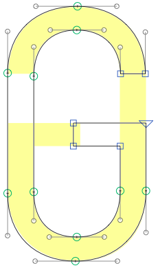

# Symmetry.glyphsReporter

This is a plugin for the [Glyphs font editor](http://glyphsapp.com/) by Georg Seifert. In Edit view, it displays a soft yellowish, mirrored image of the current glyph behind the paths, so you can check if a design is truly symmetrical.

After installation, it will add the menu item *View > Show Symmetry*. You can set a keyboard shortcut in System Preferences. You can chang vertical and horizontal mirroring through the context menu.

### Installation

1. Download the complete ZIP file and unpack it, or clone the repository.
2. Double click the .glyphsReporter file. Confirm the dialog that appears in Glyphs.
3. Restart Glyphs

### Usage Instructions

1. Open a glyph in Edit View.
2. Use *View > Symmetry* to toggle the preview of the instances.
3. Right-click to access the context menu and choose *Toggle Horizontal Flip*, or *Toggle Vertical Flip*, respectively, to adjust the way the  mirroring.

### Related

Symmetry mirrors the glyph around its horizontal and/or vertical central axis (depending on what you set via the context menu, see Usage Instructions, step 3). If all you want is a rotated view, try Mark Frömberg’s *Show Rotated* plugin [from his Plugins repository](https://github.com/DeutschMark/Glyphsapp-Plugins).

Both Symmetry and Show Rotated only *display* the glyph in a different way, they do not change your paths. But if you want to turn path segments symmetric, check out Tim Ahrens’ Symmetrify script [in his Glyphs Scripts repository on GitHub](https://github.com/justanotherfoundry/glyphsapp-scripts). Or you can use the *Paths > Distribute Nodes* scripts [in my Scripts repository](https://github.com/mekkablue/Glyphs-Scripts).

### Requirements

The plugin needs Glyphs 2.3 or higher, running on OS X 10.9.5 or later. This plugin will not work in older versions of the app.

For app versions older than 2.3, there is a file called `Symmetry_old.glyphsReporter` in this repository. I will not update the old version anymore, though.

### License

Copyright 2015 Rainer Erich Scheichelbauer (@mekkablue).
Based on sample code by Georg Seifert (@schriftgestalt).

Licensed under the Apache License, Version 2.0 (the "License");
you may not use this file except in compliance with the License.
You may obtain a copy of the License at

http://www.apache.org/licenses/LICENSE-2.0

See the License file included in this repository for further details.
